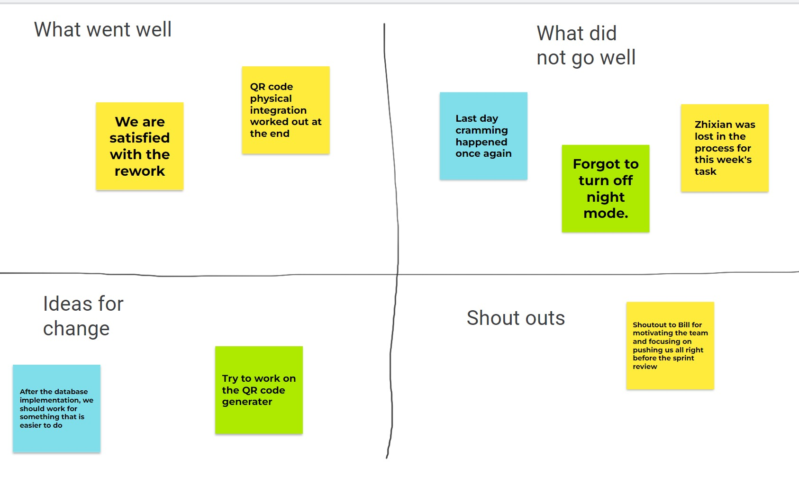

**Definition of Done:**
- Understandable code.
- Code consistently runs without errors.
- Functions as planned.
- Visually appealing/smooth transitions.
- The user interface is simple and straightforward.
- All three members are satisfied with the product.
- The users are satisfied with the product.

**Working Agreement:** \
We work best together when...
- We all share the same vision.
- We are openly communicating without filters. 
- We are all contributing as much as we can.
- We are empathetic of mistakes, setbacks, and individual circumstances.
- We meet up once in a while to "debrief".
- We communicate with ~~Discord~~ Instagram and respond within 5 hours.
- We communicate our workload and tasks actively in order to avoid conflicting file updates.
- We assign each other or ourselves up to only 2 tasks per week.
- We complete our designated tasks within a week of the assignment. 

**Calendar:** \
_*We can meet up outside of class at the end of each sprint to finish any outlying tasks.*_ \

---------------------------------------------------------------------------------------------------------

By the end of Sprint 1, we want to have...
- a finalized product name
- a completed concept flow chart of how the app will run.
- sketch of the app's UI.

By the end of Sprint 1 (ACTUAL):
- completed the UI design of the app.
End of Sprint 1:
- We planned out layout of the app and we are currently downloading the coding software.

---------------------------------------------------------------------------------------------------------

By the end of Sprint 2, we want to have...
- Created the home page with functional buttons.
- Allow the user to change the text on the cards.

End of Sprint 2 (ACTUAL):
- Created a home page.
- Added the buttons on the homepage as functionless icons.
- Created a scrollable view of cards in the middle of the screen

---------------------------------------------------------------------------------------------------------

By the end of Sprint 3, we want to have...
- We want to be able to save information onto cards using a class.
- We want to have everything we had previously but in the form of attributes and methods
- Can create multiple cards with the same format.

End of Sprint 3 (ACTUAL):
- Implemented a way to save the information onto the editcard 
- Implemented classes to store card information, along with its attributes and methods
- Able to create multiple cards with the same format using classes
- Did not implement change color or change picture within the card

---------------------------------------------------------------------------------------------------------
**Sprint #3 Retrospective:**

During this sprint and throughout the weeks, we have decided to actively push each other into completing our assigned tasks. We gave deadlines to tasks and pushed each other in chat to finish what we were assigned to. This turned out to work better than previous sprints as we felt and agreed that we have more things done per sprint compared to previous sprints. One thing that we need to fix is to coordinate what tasks we are going to do. We ended up working on the same file, but different tasks related to that file, which created problems for our merge requests. As for our next sprint, we should tell each other in chat on what files we are working on in order to not create conflicting merge requests. 

Action items: 
- We will all be actively communicating about our tasks and what we are working on.
- We will all be finishing our assigned tasks at Wednesday before the meeting day at 11:59PM.

-----------------------------------------------------------------------------
**Sprint 4 Retrospective:**  
No changes made to team charter. Team members should follow the charter more closely.

---------------------------------------------------------------------------------------------------------

**Planning CI103**

Our discussion regarding the current state of the project resulted that we will be modifying on our existing code in order to incrementally improve our product. We believe that restarting the whole project would cause a severe loss of motivation and unmanageable amounts of stress and combined with a very limited scope of 10-week timeframe, we would not be able to present a product that we can be satisfied with. Our team will be modifying the existing code as a start to this quarter and will see where it lands us after the first sprint.

---------------------------------------------------------------------------------------------------------

_signed by Bill Liu, Zhixian Li, Jiahao Wang_