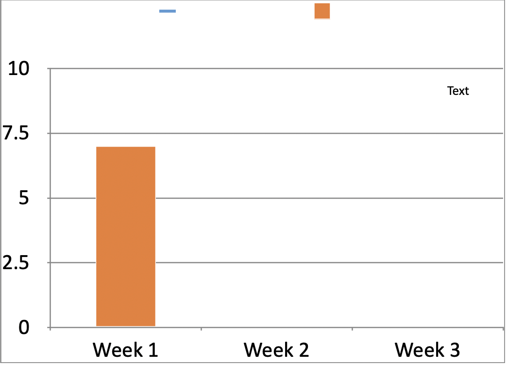
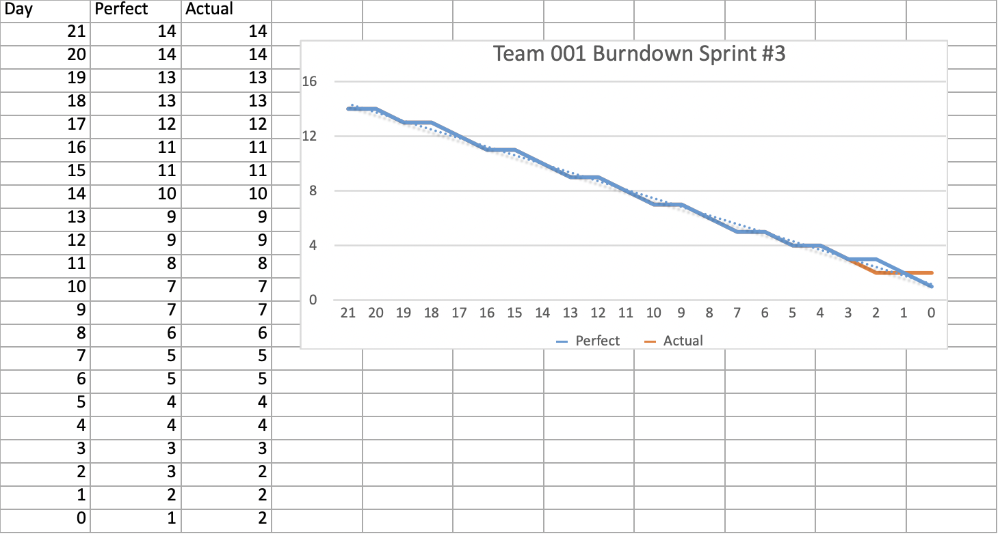
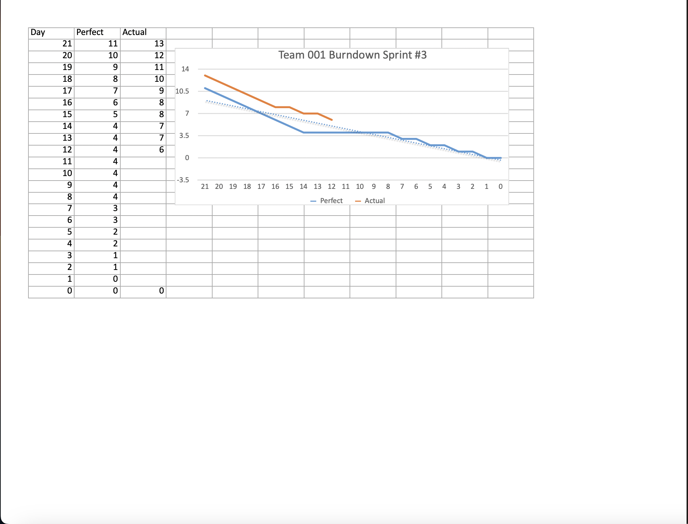
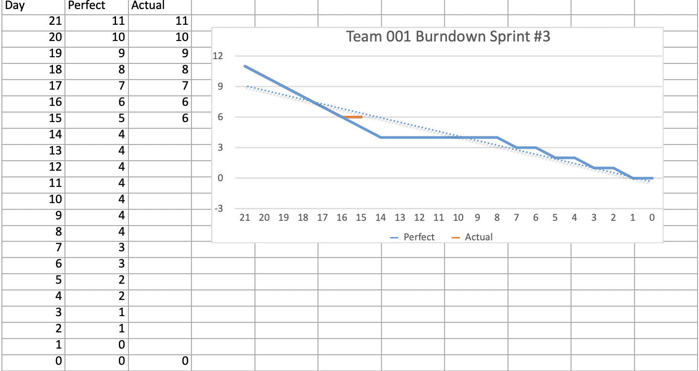
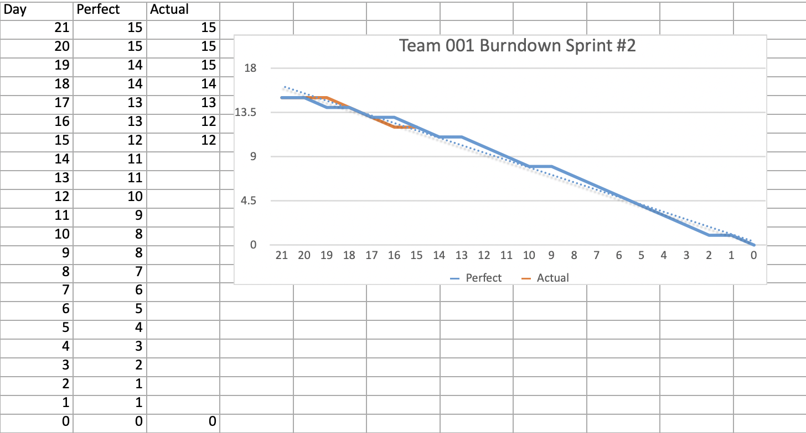

**Team Goal Sprint 5**
Push each other even more to finish weekly tasks. Spend time more wisely. Rethink the prioritizing of tasks and features.

---------------------------------------------------------------------------------------------------------
**Burndown Charts** 

**Spring Week 7** (Sprint 5 Week 1)

---------------------------------------------------------------------------------------------------------

**Sprint 4 Retrospective:**
No changes made to team charter. Team members should follow the charter more closely.

**Team Goal Sprint 4:**

Push each other and make sure to finish weekly tasks on time. Check the Kanban board regularly and hold each other accountable. Communicate more often to avoid issues with clashing code. Notify each other when starting and finishing tasks.

**Week 3 Status/Updates:** _(6/10)_ Progress is still subpar, but the database has been implemented and implementation is underway. There are certain roadblocks that get in the way, but with some more research and Youtube tutorials, we should be on our way to finishing the app by the end of the last sprint. Things that still need to get done include: figuring out how to organize and read the inputted data efficiently, making a sorting system, and full implementation of the QR code feature.

**Week 2 Status/Updates:** _(5/10)_ Progress has slowed. The database has been implemented, but SQL does not support list types as a data type by default. Figuring out a workaround using json string conversion functions will take extra time. Either way, SQFlite is a local database, so it can only simulate what our app is supposed to function like. Continuing on this route, our final product will only be a showcase of what the app could be. An alternative approach would be to focus on more front end features to round out what we lack in back end for now. The back end can be implemented later.

**Sprint 4 Documentation of Team Satisfaction:**\
**Week 1 Status/Updates:**
_(7/10)_ Progress has been decent. We still have to see what happens after we implement the database and QR code feature. Afterward, touchups can be made with organization and app customization. Definitely possible to achieve our goal in 5 more weeks, but need to put in the time and effort.

---------------------------------------------------------------------------------------------------------

**Burndown Charts** 

**Spring Week 6** (Sprint 4 Week 3)

---------------------------------------------------------------------------------------------------------

**Spring Week 5** (Sprint 4 Week 2)

---------------------------------------------------------------------------------------------------------

**Spring Week 4** (Sprint 4 Week 1)

---------------------------------------------------------------------------------------------------------

**Spring Week 3** (Sprint 3)

**Spring Week 2** (Sprint 3)

**Spring Week 1** (Sprint 3)

---------------------------------------------------------------------------------------------------------

**Spring Week 9** (Sprint 2)

**Winter Week 8** (Sprint 2)

**Winter Week 7** (Sprint 2)

---------------------------------------------------------------------------------------------------------
**Winter Week 6** (Sprint 1)

**Winter Week 5** (Sprint 1)

---------------------------------------------------------------------------------------------------------

Signed and Approved by: Vistrit Pandey (Scrum Master)